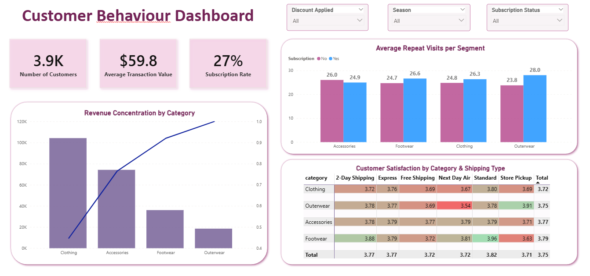

# 🛒 Retail Consumer Behaviour Analysis 

## 📌 Project Overview
This project analyzes **3,900 customer records** to identify drivers of sales performance, customer satisfaction, and long-term loyalty. By engineering an end-to-end data pipeline, the analysis uncovers a **27% subscription rate** opportunity and isolates specific logistical bottlenecks affecting brand reputation.

## 🛠️ Tech Stack
* **Python (Pandas):** Data cleaning, imputation of missing ratings, and feature engineering (Age Groups).
* **SQL (PostgreSQL):** Customer segmentation logic, window functions for product ranking, and revenue validation.
* **Power BI:** Interactive dashboarding with DAX-driven Pareto analysis and Satisfaction Heat Maps.

## 🔍 Key Findings
1.  **Revenue Concentration (Pareto Principle):**
    * **Clothing** and **Accessories** account for the vast majority of total revenue.
    * *Strategic Action:* Inventory priority must be given to these "Vital Few" categories to prevent revenue loss.

2.  **The Loyalty Gap:**
    * Only **27%** of customers are subscribers.
    * **Insight:** Subscribers demonstrate a significantly higher **repeat visit frequency** (Avg: 28 visits vs. 23 for non-subscribers in Outerwear), validating the value of the loyalty program.

3.  **Operational Risk (Shipping Crisis):**
    * Identified a critical satisfaction drop **(Rating: 3.54)** in the **Outerwear** category when shipped via **Next Day Air**.
    * *Strategic Action:* Immediate investigation into packaging and handling for rushed heavy shipments is required to reduce churn.

## 📂 Repository Structure
* `customer_shopping_behavior_analysis.ipynb`: Python notebook for data cleaning, null handling, and feature engineering.
* `querries.sql`: SQL scripts used for customer segmentation and validation queries.
* `customer_behavior.pbix`: The interactive Power BI dashboard file.
* `Consumer Behaviour Analysis Report.pdf`: The detailed final presentation report for stakeholders.
* `Business Problem Document.pdf`: Outline of the initial business objectives and scope.
* `customer_shopping_behavior.csv`: The raw dataset used for this analysis.

## 🚀 How to Run
1.  **Data Prep:** Open `customer_shopping_behavior_analysis.ipynb` to see the Python data cleaning process.
2.  **Database:** Load the CSV into your SQL database and run the scripts in `querries.sql`.
3.  **Visualization:** Open `customer_behavior.pbix` in Power BI to explore the interactive dashboard.

---
*Author: Adarsh E Reji* | *Data Analyst Portfolio*

